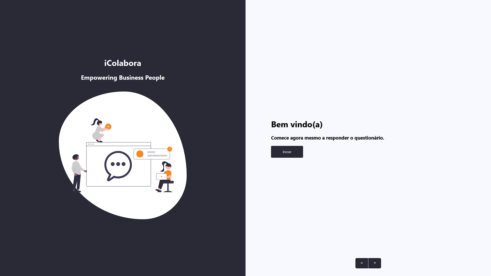
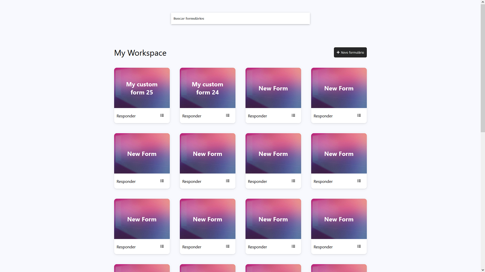

# Teste II - Fullstack Development
# Lucas Santos

## O projeto está disponível no heroku
https://icolabora-app-ls.herokuapp.com/

## Um pouco o projeto

Desenvolvi o teste usando NodeJS para a API e ReactJs para o front-end <3

- Front-end: React, SCSS ♥️
- Backend: NodeJS ♥️
- Banco de Dados: MongoDB

## Como usar o projeto

- API
    - Crie seu cluster no mongoDB remoto
    - Adicione o .env de acordo com o .env.example
    - npm install
    - node .

- APP
    - Adicione 0 .env de acordo com o .env.example
    - npm install
    - npm run start

Att: Lucas Santos